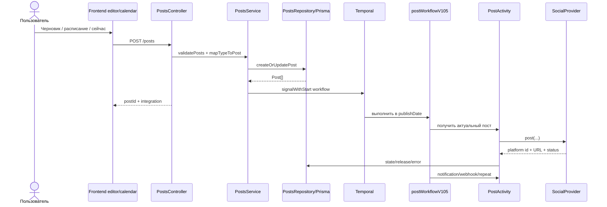

# Жизненный цикл контента

**Статус:** `current`
**Проверено:** 2026-08-20

## От редактора до платформы

Ключевые исходники:

- [PostsController](../../apps/backend/src/api/routes/posts.controller.ts);
- [PostsService](../../libraries/nestjs-libraries/src/database/prisma/posts/posts.service.ts);
- [PostsRepository](../../libraries/nestjs-libraries/src/database/prisma/posts/posts.repository.ts);
- [postWorkflowV105](../../apps/orchestrator/src/workflows/post-workflows/post.workflow.v1.0.5.ts);
- [PostActivity](../../apps/orchestrator/src/activities/post.activity.ts).

## Состояния Post

Канонические значения заданы enum `State` в [Prisma schema](../../libraries/nestjs-libraries/src/database/prisma/schema.prisma):

| Состояние   | Смысл                                                   |
| ----------- | ------------------------------------------------------- |
| `DRAFT`     | сохраняется и редактируется, но не должен публиковаться |
| `QUEUE`     | готов к обработке workflow в `publishDate`              |
| `PUBLISHED` | провайдер вернул успешный результат                     |
| `ERROR`     | публикация завершилась ошибкой                          |

UI передает тип операции `draft`, `schedule`, `now` или `update`. Repository преобразует первые три в состояние и дату. `now` использует текущее время, `update` сохраняет существующее состояние.

## Группы и цепочки

Один пользовательский материал может стать несколькими строками `Post`:

- `group` связывает публикации одной операции;
- `parentPostId` формирует последовательность сообщений или комментариев;
- `delay` задает паузу между элементами;
- `integrationId` определяет целевой канал;
- `settings` и `image` хранят сериализованные provider-specific данные;
- `intervalInDays` включает повторение.

Такой формат важен для будущей миграции: одобренный вариант Content Factory должен материализоваться через существующий DTO и сервис, а не писать строки `Post` напрямую.

## Валидация

Перед записью controller вызывает серверную `validatePosts`. Для каждого канала проверяются:

- наличие текста или изображения;
- provider-specific settings;
- поддерживаемые типы/количество медиа;
- максимальная длина;
- дополнительные правила конкретного provider.

Черновик допускает часть незавершенных platform settings, но пустой материал не допускается. Перед реальной публикацией workflow снова работает с актуальной записью и состоянием.

## Планирование и изменение даты

`PostsService.startWorkflow` запускает или сигнализирует workflow с идентификатором `post_<post.id>` и task queue, производной от provider. Повторный сигнал `poke` будит существующий экземпляр после редактирования или переноса даты. `changeDate` может:

- `schedule` — изменить дату, очистить release data и вернуть материал в очередь;
- `update` — изменить только дату, не меняя состояние.

## Публикация и результат

`postWorkflowV105`:

1. читает пост и проверяет, что он все еще в очереди;
2. ждет до `publishDate`;
3. загружает цепочку и интеграцию;
4. обрабатывает отключенный канал или необходимость переподключения;
5. вызывает activity на provider-specific task queue;
6. сохраняет platform id, URL, состояние или ошибку;
7. отправляет уведомления и webhooks;
8. запускает plugs и, при необходимости, следующий повтор.

Текущий production contract — `postWorkflowV105`. Уже использованный workflow не редактируют несовместимо: создают следующую версию. Причина зафиксирована в [ADR-0003](../adr/0003-version-temporal-contracts.md).

## Контекстная генерация и черновики

Первый вертикальный срез контентного интеллекта использует один серверный
`content-context/v1` в четырёх сценариях:

- `POST /posts/generator` один раз собирает контекст до AI admission и передаёт
  точную привязку ранним и финальным NDJSON-событием;
- редактор получает неизменяемый снимок через `/copilot/research`, сохраняет
  его вместе с цитатами каждого элемента и проверяет ту же привязку при
  повторном открытии;
- Copilot/Mastra включает контекстный режим только по серверному признаку.
  Обычный MCP/agent сохраняет прежние `draft|schedule|now`, а контекстный режим
  допускает только черновик и останавливается до provider при отсутствии
  доказательств;
- новый `autoPostDraftV2Workflow` использует закреплённую опубликованную версию
  профиля и текущий разрешённый снимок источника, создаёт только `DRAFT` и
  атомарно сохраняет `Post`, provenance и `lastUrl`. Контракт AutoPost V1 не
  изменён.

Сохранённый результат связывает `Post` с `ContentContextSnapshot`, выбранной
`ProjectBrandProfileVersion`, `ContentOutputContext` и `DraftEvidence`.
Обязательный просроченный, удалённый, противоречивый или чужой контекст даёт
`CONTENT_EVIDENCE_REQUIRED` до модели; безопасный нейтральный режим виден
пользователю и не называется grounded. Прямой URL/RSS fetch выключен по
умолчанию и включается только отдельной серверной capability после проверки
прав и robots. Следующая целевая граница — бриф, редакционная проверка и
согласование из [области продукта](../product/product-scope.md#целевой-цикл-content-factory).
