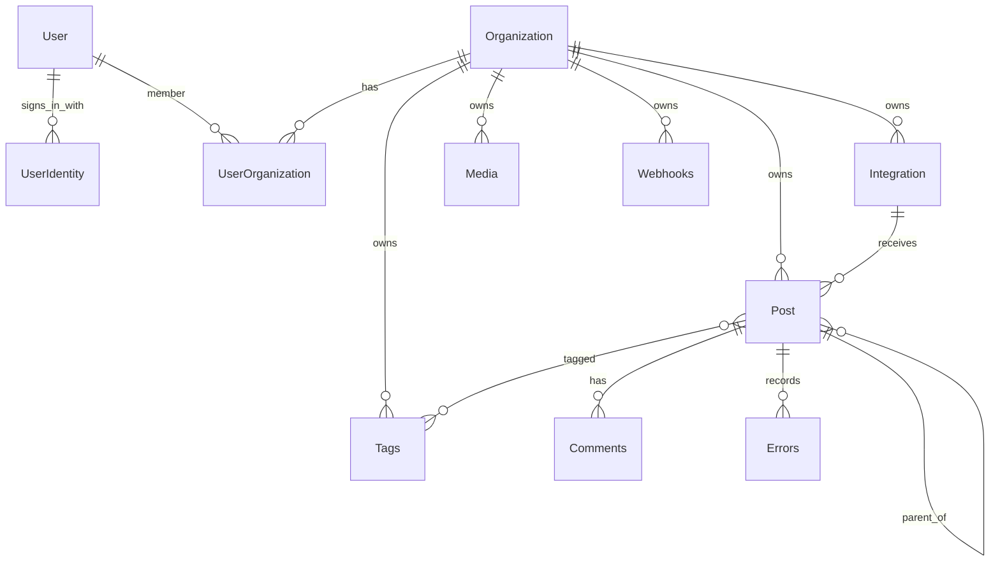

# Модель данных

**Статус:** `current + target boundary`
**Проверено:** 2026-08-20

Каноническая runtime-схема находится в [schema.prisma](../../libraries/nestjs-libraries/src/database/prisma/schema.prisma). PostgreSQL — хранилище продуктового состояния; Prisma — обязательная граница доступа к нему.

## Мультитенантное ядро



`Organization` — tenant root. Большинство пользовательских данных содержит прямой `organizationId` или связаны через объект, принадлежащий организации. `UserOrganization` связывает пользователя с организациями и хранит `role`/`disabled`.

## Ключевые группы сущностей

### Доступ и коммерция

- `User`, `UserOrganization`, `Organization` — идентичность и членство;
- `UserIdentity` — способы входа одного аккаунта: `(provider, providerIdentifier)`
  и владелец `userId`. Для `LOCAL` идентификатор — нормализованный email
  (обрезанный, в нижнем регистре), для внешнего провайдера — его стабильный
  subject, а не почта из профиля. Таблица аддитивная: legacy-поля
  `User.providerName`/`providerId`/`email` остаются на месте и служат запасным
  путём поиска, пока не выполнен
  [перенос способов входа](../operations/user-identity-backfill.md);
- `Subscription`, `Credits`, `UsedCodes` — тариф и лимиты;
- `AiProviderSetting` — выбранный организацией режим AI. Значение
  `workspace_key` по умолчанию использует только зашифрованные ключи этой
  организации; `included` — только управляемые серверные ключи. Prisma default
  сохраняет совместимость существующих строк, а регистрация новой организации
  явно создаёт связанную настройку `included` в том же statement;
- `AiUsageRecord` — журнал допуска AI-операций по организации, режиму,
  операции, provider/model и итоговому статусу. В нём намеренно нет prompt,
  output, ошибки provider, payload, token- или cost-полей. Это raw-журнал с
  90-дневным физическим удалением по `createdAt`;
- `PublicGrowthTrustedEvent` — временный receipt доверенного события. В нём
  хранится только domain-separated HMAC исходного organization-derived ключа,
  вычисленный стабильным `PUBLIC_GROWTH_DEDUPE_KEY`, а не сам идентификатор и
  не обычный hash. Receipt физически удаляется через 90 дней по `createdAt`;
- `PublicGrowthDaily` — обезличенный дневной агрегат по закрытому набору грубых
  измерений. Он не содержит organization-derived идентификаторов и не входит
  в 90-дневное удаление raw-строк;
- `Subscription.includedAiMonthlyOperations` — месячный предел managed
  операций. Совместимое значение по умолчанию `0`: до отдельного решения о
  тарифах режим `included` закрыт;
- `Customer`, `SocialMediaAgency`, `Orders`, `Messages*` — агентские и marketplace-сценарии.

### Каналы и доставка

- `Integration` — подключенный аккаунт: provider identifier, encrypted/opaque tokens, refresh state, posting times и дополнительные настройки;
- `Post` — единица или элемент цепочки публикации;
- `Comments` и `Errors` — обсуждение и журнал ошибок поста;
- `Tags`/`TagsPosts`, `Signatures`, `Sets` — организация редакционной работы;
- `Webhooks`/`IntegrationsWebhooks`, `Plugs` — реакция на события и автоматизация;
- `AutoPost` — автоматические источники публикаций; флаг `researchEnabled`
  включает веб-обогащение только перед переписыванием и по умолчанию равен
  `false` для совместимости с существующими источниками.

### Контентный интеллект

- `ProjectBrandProfile`, `ProjectBrandProfileVersion` и
  `BrandProfileAuditEvent` — один профиль организации, изменяемые черновики,
  неизменяемые опубликованные версии и журнал переходов. `AutoPost` может
  ссылаться только на опубликованную версию той же организации.
- `ContentSource`, `SourceSyncRun`, `SourceSnapshot` и `SourceEvidence` —
  разрешённый источник, проверка, неизменяемый снимок и точные выдержки.
  `currentSnapshotId` и `resultSnapshotId` используют составные tenant-связи,
  поэтому повторная проверка того же содержимого не требует менять снимок.
- `ContentFact`, `ContentFactEvidence` и `ContentEvidenceAssessment` отделяют
  изменяемое утверждение организации от неизменяемого доказательства и его
  оценки.
- `ContentContextSnapshot` и `ContentContextItem` замораживают ровно тот
  ограниченный контекст, который был передан сценарию создания. В снимке нет
  сетевого или модельного вызова: он собирается детерминированно из уже
  сохранённых разрешённых данных.
- `ContentOutputContext` и `DraftEvidence` связывают каждый сохранённый
  черновик с точным снимком, версией профиля и использованными доказательствами.
  `PostContent.usedCitationIds` хранит цитаты по элементам цепочки;
  устаревший общий список допустим только для одиночного материала.

### Медиа и данные агентов

- `Media` — файл, путь, тип, размер, thumbnail и tenant owner;
- `mastra_*` — сообщения, threads, traces, evals и workflow snapshots текущего agent/runtime слоя;
- `ThirdParty`, `OAuthApp`, `OAuthAuthorization` — внешние клиенты и приложения.

## Инварианты, которые нельзя обходить

- Любой запрос пользовательского объекта фильтруется по `organizationId`.
- Подключенный канал уникален как `(organizationId, internalId)`.
- Членство уникально как `(userId, organizationId)`.
- Способ входа уникален глобально как `(provider, providerIdentifier)`; удаление
  пользователя каскадом удаляет его `UserIdentity`.
- У одного пользователя не может быть двух `LOCAL`-способов входа, а последний
  оставшийся способ нельзя отвязать.
- `LOCAL`-способ создаётся только после подтверждения владения адресом по
  письму; внешний — только по subject, который вернул сам провайдер.
- `Post.integrationId` должен указывать на канал той же организации; сервисы используют compound connect с `organizationId`.
- Все ссылки источника, профиля, контекста и результата используют составные
  связи `(organizationId, id)`; клиентский `organizationId` не принимается как
  источник доверия.
- Изменение или очистка provenance у `Post`, `ContentOutputContext` и
  `DraftEvidence` происходит одной транзакцией. Удалённый, чужой,
  противоречивый или просроченный обязательный контекст закрывает операцию до
  модельного вызова.
- Удаляемые пользовательские объекты часто используют `deletedAt`; физическое удаление нельзя предполагать без проверки модели.
- `Post.settings` и `Post.image` сейчас сериализованы строками; менять формат нужно совместимо с историческими строками и workflow.
- OAuth/access/refresh tokens и API keys — секретные runtime-данные, они не попадают в Git, fixtures или документацию.
- Один AI-вызов допускается через общий operation seam. Для `included` подсчёт
  и создание `AiUsageRecord` идут в Serializable-транзакции с ограниченным
  повтором конфликта; переход на другой источник не является fallback.
- Raw-строки `PublicGrowthTrustedEvent` и `AiUsageRecord` удаляет единый
  repository-owned процесс из
  [SaaS readiness](../operations/saas-readiness.md). Оба пути уже имеют индекс
  `createdAt`; дневные growth-агрегаты процесс не читает и не удаляет.

## Где живут запросы

Prisma client оборачивается общими сервисами и repository-классами в [database/prisma](../../libraries/nestjs-libraries/src/database/prisma). Типичный путь изменения:

```text
DTO -> Controller -> Service/Manager -> Repository -> Prisma
```

Raw SQL не является стандартным путем. Изменение схемы требует миграционной стратегии, обратимости и проверки исторических данных; `prisma db push --accept-data-loss` допустим только для локальной среды и не является production migration plan.

## Целевая модель Content Factory

Первый вертикальный срез контентного интеллекта уже хранится отдельно от
`Post`: профиль, источники, доказательства, факты и снимки контекста имеют свои
таблицы, а `Post` содержит только минимальные ссылки на точный результат.
Следующая целевая граница остаётся такой:

```text
Organization
  ├─ ProjectProfile
  ├─ Source -> Evidence/Memory
  ├─ TopicCandidate -> ContentBrief
  └─ ContentBrief -> GenerationRun -> ContentVariant -> Review -> Approval
                                                     └-> Materialized Post[]
Post -> PerformanceFeedback -> Topic/Brief
```

Рекомендуемые свойства:

- tenant ownership на каждом корневом объекте;
- неизменяемое происхождение источника и результата генерации;
- явные версии prompt/model/policy;
- отделение машинной оценки от решения человека;
- отдельная связь материализации с `Post.group` или первым `Post.id`;
- журнал переходов состояний;
- удаление/экспорт на уровне организации.

`ProjectProfile`, `Source`, evidence/memory и materialized provenance в этой
схеме уже представлены моделями первого вертикального среза. `TopicCandidate`,
`ContentBrief`, `GenerationRun`, редакционная оценка и approval остаются
целевой схемой, а не обещанием готового runtime. Продуктовая AGPL-модель
принята в [ADR-0005](../adr/0005-release-content-factory-next-under-agpl.md).

## Владение Git и БД

Git хранит код, Prisma schema/migrations, безопасные примеры конфигурации, ADR, prompts/policies как versioned artifacts и обезличенные fixtures. PostgreSQL хранит проекты, источники, результаты, публикации, токены и пользовательские решения. Граница зафиксирована в [ADR-0004](../adr/0004-git-and-database-ownership.md).
