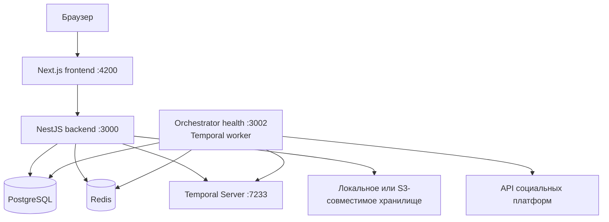

# Обзор архитектуры

**Статус:** `current`
**Проверено:** 2026-08-11 по Postiz `v2.22.1`

## Форма репозитория

Это pnpm-монорепозиторий. Исполняемые приложения находятся в `apps/`, общие исходники — в `libraries/`. Алиасы `@contentfactory/*` определены в [tsconfig.base.json](../../tsconfig.base.json); общие библиотеки не являются отдельными workspace-пакетами с собственными `package.json`.

| Область | Путь | Ответственность |
| --- | --- | --- |
| Web UI | [apps/frontend](../../apps/frontend) | Next.js, продуктовые экраны, редактор, календарь, SWR-состояние |
| HTTP API | [apps/backend](../../apps/backend) | NestJS, auth, контроллеры, public API, прикладные сервисы |
| Durable worker | [apps/orchestrator](../../apps/orchestrator) | Temporal worker, workflow и activities |
| Browser extension | [apps/extension](../../apps/extension) | подключение платформ с cookie-based flow |
| SDK | [apps/sdk](../../apps/sdk) | внешний Node-клиент Postiz |
| CLI commands | [apps/commands](../../apps/commands) | отдельные командные сценарии |
| Server domain | [libraries/nestjs-libraries](../../libraries/nestjs-libraries) | Prisma, сервисы, интеграции, DTO, Temporal wiring |
| Shared UI | [libraries/react-shared-libraries](../../libraries/react-shared-libraries) | переиспользуемые React-части и локализация |
| Helpers | [libraries/helpers](../../libraries/helpers) | общие browser/server utilities |

## Компоненты во время выполнения



В упакованном compose frontend, backend и orchestrator собираются в один контейнер приложения, но логические границы и процессы сохраняются. Локальный compose поднимает инфраструктуру, а приложения запускаются через pnpm.

## Зависимости и направление вызова

Основной прикладной путь:

```text
frontend -> backend controller -> service/manager -> repository -> Prisma/PostgreSQL
                                          |
                                          +-> Temporal client -> workflow -> activity -> provider
```

Правила:

- контроллеры отвечают за HTTP-контракт, auth context и первичную валидацию;
- сервисы координируют сценарий и не должны доверять клиентской валидации;
- репозитории владеют запросами Prisma;
- `IntegrationManager` выбирает платформенный провайдер;
- workflow описывает долговременную последовательность, activity выполняет побочные эффекты;
- платформенные особенности остаются внутри provider implementation;
- frontend не обращается к Prisma, Temporal или провайдерам напрямую.

## Точки входа

- [Frontend app](../../apps/frontend/src/app) — файловые маршруты Next.js.
- [Backend main](../../apps/backend/src/main.ts) — Nest app, CORS, validation, filters, Swagger и HTTP port.
- [Backend AppModule](../../apps/backend/src/app.module.ts) — модули данных, API, public API, агенты, Temporal client и throttling.
- [API module](../../apps/backend/src/api/api.module.ts) — контроллеры и auth middleware.
- [Orchestrator main](../../apps/orchestrator/src/main.ts) — worker process и health port.
- [Orchestrator AppModule](../../apps/orchestrator/src/app.module.ts) — activities и Temporal worker.
- [Workflow exports](../../apps/orchestrator/src/workflows/index.ts) — зарегистрированные workflow.
- [Prisma schema](../../libraries/nestjs-libraries/src/database/prisma/schema.prisma) — каноническая модель runtime-данных.

## Синхронные и асинхронные границы

Синхронный HTTP-путь используется для чтения, валидации и записи намерения пользователя. Публикация не должна удерживать HTTP-запрос до запланированного времени: backend запускает или сигнализирует Temporal workflow. Orchestrator позднее читает актуальное состояние из БД и вызывает provider.

Исключение — AI-генерация `/posts/generator`: сервер возвращает поток JSON-событий в открытом HTTP-ответе. Это генерация контента, а не доставка в канал.

## Наблюдаемость и внешние зависимости

Наблюдаемость сейчас складывается из Temporal UI, health endpoint оркестратора и таблиц ошибок/уведомлений в БД; внешнего сборщика ошибок в дереве нет — его удалили вместе с остальными сторонними клиентами, возврат на своём GlitchTip описан в `content-factory-next-ry5.4`. Compose включает PostgreSQL, Redis, Temporal PostgreSQL, Elasticsearch и Temporal UI. Конкретные значения и безопасные правила находятся в [конфигурации](../operations/configuration.md) и [эксплуатации](../operations/runtime.md).

## Локальный граф кода

Graphify индексирует исходники в игнорируемую Git папку `graphify-out/`. Текущие счетчики узлов, ребер и кластеров находятся в локальном `GRAPH_REPORT.md`, который обновляется до принятого `HEAD`; построение не использует платные tokens. Эти счетчики меняются вместе с корпусом и не являются продуктовым контрактом. Граф — навигационный индекс, а не новый источник истины. Порядок обновления описан в [сопровождении документации](../maintenance/documentation.md#локальный-граф-зависимостей).
