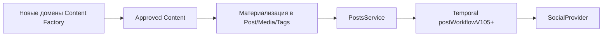

# Карта миграции из Content Factory

**Статус:** `target`
**Проверено:** 2026-08-11

## Цель

Перенести ценность прежнего Content Factory в новый открытый AGPL-продукт, не превращая репозиторий в механическую смесь двух систем. Postiz остается исполняемой основой, а старый репозиторий `/home/me/code/content-factory` — донор требований, схем, проверенных продуктовых идей и только той реализации, права и сторонние лицензии которой проверены.

## Неподвижные границы

- Новый репозиторий наследует AGPL-3.0 от Postiz.
- ADR-0005 фиксирует выбор открытой AGPL-модели; коммерческая лицензия Postiz не требуется.
- Код из донора копируется только после проверки владения, сторонних лицензий, AGPL-совместимости и публичной безопасности.
- До внешнего preview исходники могут оставаться локальными; перед первым внешним пользователем точная развернутая версия получает бесплатный source offer.
- Донор не изменяется в рамках этого проекта.
- Секреты, приватные источники, реальные аккаунты и клиентские материалы не мигрируют.
- Сначала переносится модель предметной области и контракт данных, затем интерфейс и автоматизация.

### Открыто к лицензионному шлюзу перед публикацией (`cft`)

- `@sentry/cli` приходит транзитивно (`@sentry/nextjs` → `@sentry/webpack-plugin` → `@sentry/bundler-plugin-core`) и лицензирован **FSL-1.1-MIT** — Functional Source License, не OSI-лицензия, в дереве AGPL-3.0-проекта. Сами `@sentry/nestjs`, `@sentry/nextjs`, `@sentry/core`, `@sentry/node` и `@sentry/browser` — MIT, конфликта с AGPL нет. Пакет не собирается и не исполняется у нас: скрипт установки заблокирован (`onlyBuiltDependencies: ["bcrypt"]`), бинарь приходит готовым, сетевых обращений при установке нет, `withSentryConfig` не используется. До публикации репозитория решить: оставить как транзитивную зависимость сборки с записью в шлюзе или исключить.

## Что сохранить из основы Postiz

| Возможность | Текущий владелец | Решение |
| --- | --- | --- |
| Организации, пользователи, роли | Prisma + auth middleware | Сохранить и расширять |
| Каналы и OAuth | Integration + providers | Сохранить |
| Редактор и календарь | frontend launches/new-launch | Сохранить, постепенно адаптировать |
| Черновики и публикации | Posts API/service/repository | Сохранить как downstream-контур |
| Отложенное выполнение | Temporal workflows | Сохранить, новые контракты версионировать |
| Платформенные различия | SocialProvider implementations | Сохранить изолированными |
| Медиа и аналитика | текущие модули | Сохранить, связать с новыми сущностями |
| Биллинг/маркетплейс/прочие функции | отдельные модули | Решать по продуктовой ценности, не удалять заранее |

## Что перенести как новые домены

| Домен Content Factory | Целевая ответственность | Связь с Postiz |
| --- | --- | --- |
| Project Profile | стратегия, аудитория, голос, запреты | принадлежит `Organization` |
| Source Registry | источник, происхождение, права, свежесть | принадлежит `Organization`; не равен `Media` |
| Research Memory | утверждения, доказательства, ссылки | создается из источников |
| Topic Radar | кандидаты тем, оценка, причина выбора | формирует бриф |
| Content Brief | цель, тезис, канал, формат, доказательства | предшествует `Post` |
| Generation Run | входы, версия промпта/модели, стоимость, результат | создает варианты, но не публикует |
| Content Variant | редактируемый вариант материала | после одобрения отображается в `Post`/цепочку |
| Review | проверка фактов, стиля, политики, риска | блокирует переход к публикации |
| Approval | решение человека и журнал | разрешает материализовать `Post` |
| Performance Feedback | результат и вывод | ссылается на опубликованный `Post` |

## Предлагаемые швы интеграции

Новые сущности не должны напрямую вызывать платформы. Единственная граница доставки — существующий сервис постов и провайдеры. Это сохраняет платформенную валидацию, повторные попытки и историю выполнения в одном месте.

## Последовательность этапов

1. **Лицензия и продуктовая граница — принято.** ADR-0005 выбирает открытый AGPL-продукт и определяет source-release boundary.
2. **Инвентаризация донора.** Описать сущности, инварианты и пользовательские сценарии; проверить владение и лицензии до переноса реализации.
3. **Профиль проекта.** Добавить минимальный tenant-scoped домен и API.
4. **Источники и память.** Ввести происхождение данных и публично безопасные фикстуры.
5. **Радар и бриф.** Отделить выбор темы от генерации текста.
6. **Генерация и версии.** Добавить воспроизводимый запуск с бюджетом и журналом, без платных вызовов по умолчанию.
7. **Проверки и согласование.** Сделать явный шлюз перед созданием `Post`.
8. **Материализация и календарь.** Связать одобренный вариант с текущим редактором и Posts API.
9. **Обратная связь.** Соединить аналитику публикации с темой, брифом и следующим планом.

Каждый этап должен быть вертикальным: схема, серверный контракт, минимальный интерфейс, проверка и документация. Большая единовременная миграция не планируется.

## Критерий готовности миграционного среза

- новый объект принадлежит организации и не доступен другой организации;
- источник и преобразования прослеживаются;
- публикация невозможна до требуемого согласования;
- существующая публикация через Postiz не дублируется;
- формат экспорта и удаления определен;
- документация current/target обновлена;
- лицензионная и публичная безопасность соблюдены.
