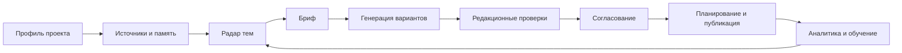

# Область продукта

**Статус:** `current + target`
**Проверено:** 2026-08-11

## Коротко

Content Factory строится как продукт управления полным циклом контента на основе Postiz. Postiz уже дает зрелую оболочку для команд, редактора, календаря, медиа, каналов, отложенной публикации и аналитики. Наш целевой слой должен добавить системную работу от источника и идеи до подготовленного, проверенного и одобренного материала.

## Что уже умеет текущая основа

Существующая кодовая база поддерживает:

- пользователей, организации, роли и команды;
- подключение социальных каналов через OAuth или специфичный для провайдера способ;
- календарь и список публикаций;
- создание черновиков, отложенных и немедленных публикаций;
- цепочки постов, комментарии, теги, повторяемые публикации и наборы;
- медиа, подписи, короткие ссылки и настройки каналов;
- публикацию во множество платформ через единый контракт;
- длительные и отложенные операции через Temporal;
- аналитику, уведомления, webhooks, public API и Node SDK;
- базовую AI-генерацию через потоковый endpoint и создание сгенерированных черновиков.

Основные пользовательские разделы видны в [маршрутах frontend](../../apps/frontend/src/app), а серверные возможности — в [API-модуле](../../apps/backend/src/api/api.module.ts).

## Чего текущая основа не моделирует как единый процесс

В текущей предметной модели нет полноценного контура Content Factory:

- паспорта проекта: продукт, аудитория, позиционирование, голос бренда и запреты;
- реестра источников с происхождением, свежестью и правами использования;
- исследовательской памяти и повторно используемых фактов;
- радара тем и прозрачного отбора идей;
- контент-брифов с тезисом, доказательствами, каналом и целью;
- управляемой генерации с версиями промптов, моделей и стоимости;
- редакционных проверок фактов, стиля, риска и соответствия бренду;
- явных стадий согласования до появления публикации в очереди;
- измеримого цикла обратной связи от результата публикации к следующему плану.

Это не означает, что в Postiz нет отдельных AI-инструментов или согласований. Разница в том, что перечисленные сущности пока не образуют самостоятельную, прослеживаемую производственную линию контента.

## Целевой цикл Content Factory

Граница между новыми и существующими возможностями проходит перед планированием: новый контур готовит одобренный материал, после чего существующие `Post`, календарь, Temporal и провайдеры берут на себя доставку.

## Основные пользователи

- владелец проекта задает стратегию, ограничения и бюджет;
- контент-менеджер ведет темы, брифы, редактуру и календарь;
- автор или AI-оператор создает варианты;
- редактор проверяет факты, стиль и риск;
- согласующий принимает или возвращает материал;
- администратор управляет организацией, каналами и доступом.

Один человек может выполнять несколько ролей. Права доступа должны оставаться привязаны к организации, как в текущей модели.

## Границы ближайшей разработки

До отдельного решения запрещены:

- копирование реализации из прежнего Content Factory без проверки владения, сторонних лицензий и публичной безопасности;
- изменение лицензии или удаление уведомлений Postiz;
- реальные публикации и подключение рабочих аккаунтов;
- платные вызовы моделей;
- перенос приватных клиентских данных или секретов.

Порядок перехода описан в [карте миграции](migration-map.md), основа форка — в [ADR-0001](../adr/0001-postiz-fork-baseline.md), а принятая открытая модель — в [ADR-0005](../adr/0005-release-content-factory-next-under-agpl.md).
